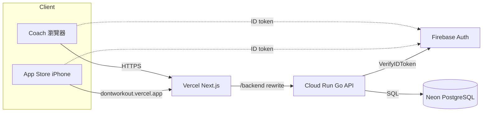
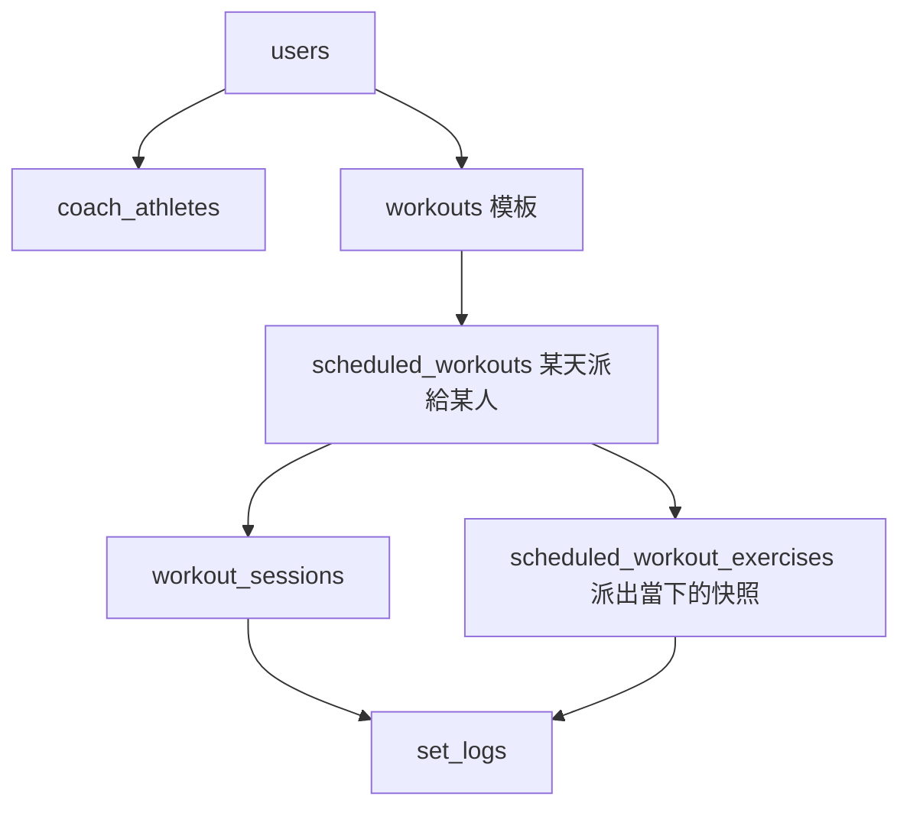

# PumpLoop 現況

**一句話** — PumpLoop 讓教練排課、學生當場記組；這份文件固定現況給面試與自學，不搬資料、不換棧。

決策展開：[`docs/decisions/`](decisions/)。

## 現況圖

**真實教練與 App Review 打 production 前端 `dontworkout.vercel.app`，再經 `/backend` 進 Cloud Run Go，最後寫 Neon。**

本機 `npx cap sync` 預設仍載入 staging alias（`apps/web/config/app-targets.json`）。那是開發殼，不是送審路徑。

## 目標圖

**沒有換基礎設施；這張圖才是產品的資料流。**

最重要的改變是沒有改架構：計劃（`workouts`）和實際（`set_logs`）是兩套表，改模板不會改寫已經發生的訓練。

## 我依賴的假設

**這三條若錯，圖或「為什麼沒有 Redis」要重寫，不是風險變高一點。**

| 假設 | 它錯了會怎樣 |
| --- | --- |
| App Review 與真實教練打 `dontworkout.vercel.app` | 現況圖 Client→Vercel 的 host 寫錯；面試演示對不上送審包 |
| ~~Staging 與 Production 共用同一筆 Postgres~~ **已推翻，2026-09-04** | 階段 3 查完了：兩條鏈從 Vercel host 到 Neon 分支全程分開（見下）。原本寫「測試寫入會進正式庫」，那句是錯的 |
| 近期維持約 3 教練、8–10 學生 | 沒有 Queue/Redis、process 內限流的理由失效，要重選 |

### 階段 3 實查結果（2026-09-04，唯讀查核）

| 層 | staging | production |
| --- | --- | --- |
| Vercel host | `performance-coach-git-staging-…vercel.app` | `dontworkout.vercel.app` |
| Cloud Run | `performance-coach-api-staging` | `performance-coach-api` |
| `DATABASE_URL` secret 名稱 | `performance-coach-staging-api-database-url:1` | `performance-coach-api-database-url:1` |
| Neon 分支 | `staging` (`br-gentle-mouse-aziy6y8w`) | `main` (`br-fancy-tree-azdvc4gx`) |

**不是只比 secret 名稱**：另外用一組只存在於 Neon `main` 的 invite code 實測，
production API 回 200、staging API 回 404，所以確定是兩個資料庫，不是兩個名字指同一個。

兩件跟著確認的事：**Firebase 專案兩邊共用（`dontworkout`），隔離的只有 Postgres，不是登入身份。**
Neon staging 分支最新資料停在 2026-08-27，`main` 已到 2026-09-01 —— 它是舊快照，不是鏡像。

## 階段

**先量現況，再對圖講 why。不改產品 code。**

| 階段 | 目標 | Done when |
| --- | --- | --- |
| 1 量測與存檔 | 把現況釘在一個 SHA 上，不改 code | 筆記同時有 `git rev-parse HEAD` 與 `cat apps/web/config/app-targets.json` 全文，標日期 |
| 2 送審 URL | 確認 IPA 載入 production | TestFlight/送審包實際載入的 origin 與 `dontworkout.vercel.app` 做一次字串比對，結果寫下 |
| 3 資料是否同庫 | ~~確認兩條 API 是不是同一 Neon~~ | **Done 2026-09-04**：不同庫。兩個 secret 名稱並排見上表，另加一次 invite code 實測 |
| 4 Neon 方案 | ~~確認 Free/Launch 與 restore 窗口~~ | **Done 2026-09-04**：Free plan，history retention **6 小時**。專案 `performance-coach-mvp`（`purple-term-41387441`），AWS ap-southeast-1 |
| 5 面試對稿 | 每篇決策能講出代價 | 11 篇 `docs/decisions/*.md` 各用約 60 秒講完「代價」那段，不看稿 |

## 會爆的地方

**現在就在用真實資料；爆點都指向上面某一個階段。**

| 風險 | 我會怎麼處理 |
| --- | --- |
| **已確認**：Neon 是 Free，PITR 只有 6 小時，資料掉了會痛 | 階段 4 查完了，確實是 Free + 6 小時。要不要升 Launch 還沒決定 —— 這是帳務操作，不是改 code |
| ~~Staging 與 Production 同庫時，staging 測試會寫進正式訓練紀錄~~ **已排除** | 階段 3 查完：不同庫。**但登入身份仍共用** —— 在 staging 註冊會在 production Firebase 建帳號，只有 Postgres 資料列留在 staging |
| ~~`app-targets.json` 沒有 `production` target~~ **已修，2026-09-04** | 已加 `production` target（`docs/tasks/2026-09-04-app-target-production.md`）。default 仍是 `staging`，所以「下次 `cap sync` 把殼指回 staging」這件事**照設計仍會發生** —— 那是開發時要的行為；送審前必須 `APP_TARGET=production npx cap sync ios`，再用 `./scripts/local-status.sh` 確認印出 `PRODUCTION` |
| Neon scale-to-zero 冷啟動（秒級，待測量） | 階段 1 記一次「當天第一個 Log Set 的等待秒數」 |
| Firebase 專案跨環境共用，token 兩邊都驗得過 | 階段 3 一併記下：隔離的是 Postgres，不是登入身份 |

## 名詞表

**只放這個專案會撞名的字。**

| 詞 | 在這裡的意思 |
| --- | --- |
| PumpLoop | 對外產品名。Repo / GCP 專案仍叫 `dontworkout`；bundle 刻意留 `com.pumpslate.app` |
| `workouts` | 可重用的課表**模板**，不是某天的課 |
| `scheduled_workouts` | 模板在某日派給某個 athlete 的那一筆 |
| `set_logs` | 實際做了什麼。改模板不會回頭改這裡 |
| invite code | 能力：指出加入哪個教練。**不是**登入密碼 |
| `/backend` | Next rewrite 到 Go 的路徑；瀏覽器不直打 Cloud Run |
| `APP_TARGET` | 選 WKWebView 載入哪個 URL。本機預設 `staging`；送審走 production |

## 週進階（load / sets / reps 各自獨立）

教練複製或「重複本週」時，每個動作可各自選：

- **重量** `loadIncrement`（已上線）
- **組數** `setIncrement` 0 或 +1（已上線）
- **次數** `repsIncrement` 自填整數（0＝不加，例如 2＝每週 +2 次）

三個開關互不綁定。 squat 可以只加重量、臥推只加次數、划船只加一組。不必同時加組又加次。

次數 bump 只套在 **REPS** 處方（整數次數）；TEXT（AMAP、8–12）不動。跟組數一樣只在 **一位學員** 的 copy / Repeat 時 prefill，多學員指派維持模板原值。已排程 snapshot 不回溯。
